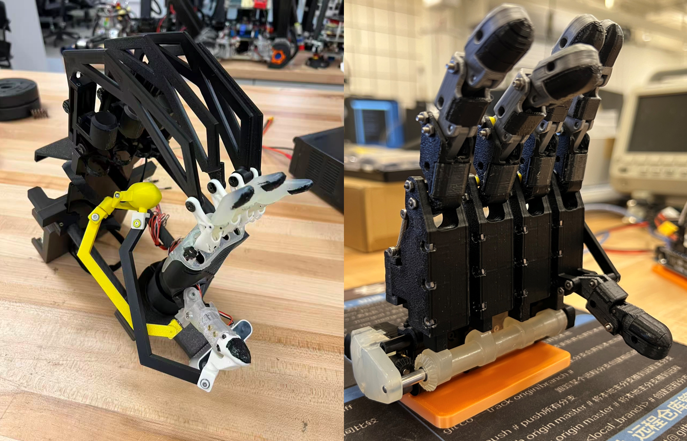

    
    <h2 class="profile-name">Mingzhang (Norman) Zhu</h2>
  
Email: normanzmz@g.ucla.edu

  <a class="md-button md-button--primary" href="assets/Mingzhang Zhu_CV_2025_condensed.pdf" download> Curriculum Vitae </a>
  

  

    <h3>About Me</h3>
    

      Hello! I am Mingzhang Zhu (朱明彰). I’m a Ph.D. candidate in Robotics at the
      <a href="https://www.romela.org/">Robotics & Mechanisms Laboratory (RoMeLa)</a>,
      <a href="https://www.ucla.edu/">University of California, Los Angeles (UCLA)</a>,
      advised by Prof. Dennis W. Hong. My research focuses on mechanism design, humanoid locomotion, and humanoid robot soccer compeition.
    

    <h3>Education</h3>
    <ul>
      <li>Ph.D. student in Mechanical & Aerospace Engineering, UCLA, 2021 - present</li>
      <li>B.S. in Mechanical Engineering and Robotics, Worcester Polytechinic Institute, 2017 - 2021</li>
    </ul>
    <h3>Research Interests</h3>
    <ul>
      <li>Mechanisms and Designs </li>
      <li>Dexterous Manipulation</li>
      <li>Humanoid Robots Locomotion</li>
      <li>Robot Soccer</li>
    </ul>
  

---

## Selected Projects

  

    <!-- Use one of these three: IMG / MP4 / YouTube -->
    <!-- A) Image -->
    
    <!-- B) Local MP4 (optional)
    <video src="assets/bruce_walk.mp4" controls playsinline></video>
    -->
    <!-- C) YouTube embed (optional)
    

      <iframe src="https://www.youtube.com/embed/VIDEO_ID" title="BRUCE demo" frameborder="0" allowfullscreen></iframe>
    

    -->
  

  

    <h3>A Humanoid Robot Movie Character: Kid Cosmo</h3>
    

    Kid Cosmo is a humanoid robot developed for Netflix’s sci-fi movie “The Electric State.” The project involved a year-long full-stack development effort, combining mechanical design, control systems, and real-time puppeteering for expressive on-camera performance.
    

    <ul>
      <li>Designed a compact torso, tightly integrating electronics within a constrained outer shell.</li>
      <li>Developed a model-based controller for dynamic locomotion with coordinated upper-body motions. </li>
    </ul>
    
<a class="md-button" href="Project/Cosmo/cosmo/">More Info</a>

  

  

    
  

  

    <h3>Humanoid Soccer Competition: Robocup</h3>
    

      Full perception stack for ARTEMIS: YOLOv8 + classical 3D geometry for detection,
      pose, segmentation, and robust outlier handling in noisy RoboCup environments.
    

    <ul>
      <li>Object detection + 3D pose & point-cloud fusion</li>
      <li>Proximal outlier rejection for heavy noise</li>
      <li>Enabled 45 goals across 6 matches</li>
    </ul>
    
<a class="md-button" href="project/Robocup/robocup">More Info</a>

  

 

  

    
  

  

    <h3>Robotic Hand & Data Collection Device (Ongoing)</h3>
    

      Full perception stack for ARTEMIS: YOLOv8 + classical 3D geometry for detection,
      pose, segmentation, and robust outlier handling in noisy RoboCup environments.
    

    <ul>
      <li>Object detection + 3D pose & point-cloud fusion</li>
      <li>Proximal outlier rejection for heavy noise</li>
      <li>Enabled 45 goals across 6 matches</li>
    </ul>
    
<a class="md-button" href="project/Hand/hand">More Info</a>

  

---

## News
- **2025-09** — Won the "Mike Stilman Best Paper Award" on IEEE Humanoids 2025!
- **2025-05** — Won the "Best Demo Award" in IEEE ICRA 2025!
- **2025-03** —  Passed Ph.D. Qualifying Examination and Advanced To Candidacy!
